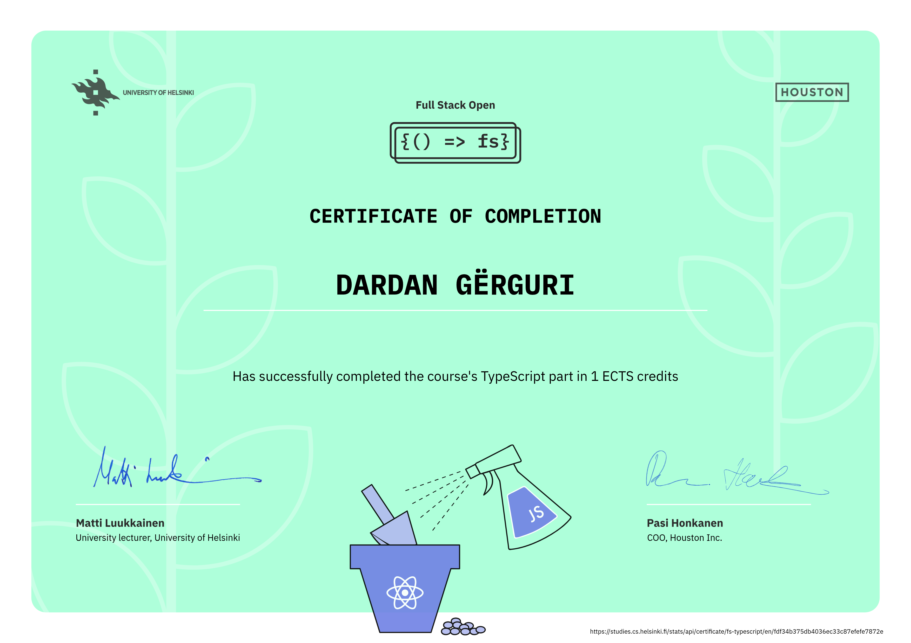

# Full Stack Open

Welcome to my repository for the [Full Stack open](https://fullstackopen.com/en/) course offered by the Department of Computer Science at the University of Helsinki.

### 🚀 Overview
This repository contains the solutions for parts 0 to 9, and parts 10 to 13 are in separate repositories (links are in the sections below).

## 🛠️ Technology Stack

The complete solutions demonstrate proficiency across the following technologies:

### Frontend
* **JavaScript & TypeScript**
* **React** (with Hooks, Router, Redux, React Query)
* **E2E Testing** (Cypress / Playwright)

### Backend
* **Node.js & Express**
* **MongoDB** (via Mongoose)
* **PostgreSQL**
* **GraphQL** (via Apollo)
* **Jest/Vitest** (Unit & Integration Testing)

### DevOps & Infrastructure
* **Docker & Docker Compose**
* **CI/CD** (GitHub Actions)

## Course Content

### [Part 0 - Fundamentals of Web Apps](https://fullstackopen.com/en/part0)

Topics: `HTML/CSS`, `JavaScript libraries`, `HTTP requests`, `JSON`, `DOM manipulation`.

Projects:
- [Sequence Diagrams](https://github.com/dardangerguri/FullStackOpen/tree/main/part0) - Illustrate network communication flow for single page apps and for traditional apps.

### [Part 1 - Introduction to React](https://fullstackopen.com/en/part1)

Topics: `React components and JSX`, `Props and state management`, `Event handlers`, `React hooks (useState)`.

Projects:
- [Course Info](https://github.com/dardangerguri/FullStackOpen/tree/main/part1/courseinfo) - Display course information with React components.
- [Unicafe](https://github.com/dardangerguri/FullStackOpen/tree/main/part1/unicafe) - Feedback system with state management using hooks.
- [Anecdotes](https://github.com/dardangerguri/FullStackOpen/tree/main/part1/anecdotes) - Anecdote voting platform.

### [Part 2 - Communicating with server](https://fullstackopen.com/en/part2)

Topics: `React components and JSX`, `Props and state management`, `Event handlers`, `React hooks (useState)`.

Projects:
- [Course Info](https://github.com/dardangerguri/FullStackOpen/tree/main/part1/courseinfo) - Display course information with React components.

### [Part 3 - Programming a server with NodeJS and Express](https://fullstackopen.com/en/part3)

Topics: `React components and JSX`, `Props and state management`, `Event handlers`, `React hooks (useState)`.

Projects:
- [Course Info](https://github.com/dardangerguri/FullStackOpen/tree/main/part1/courseinfo) - Display course information with React components.

### [Part 4 - Testing Express servers, user administration](https://fullstackopen.com/en/part4)

Topics: `React components and JSX`, `Props and state management`, `Event handlers`, `React hooks (useState)`.

Projects:
- [Course Info](https://github.com/dardangerguri/FullStackOpen/tree/main/part1/courseinfo) - Display course information with React components.

### [Part 5 - Testing React apps](https://fullstackopen.com/en/part5)

Topics: `React components and JSX`, `Props and state management`, `Event handlers`, `React hooks (useState)`.

Projects:
- [Course Info](https://github.com/dardangerguri/FullStackOpen/tree/main/part1/courseinfo) - Display course information with React components.

### [Part 6 - Advanced state management](https://fullstackopen.com/en/part6)

Topics: `React components and JSX`, `Props and state management`, `Event handlers`, `React hooks (useState)`.

Projects:
- [Course Info](https://github.com/dardangerguri/FullStackOpen/tree/main/part1/courseinfo) - Display course information with React components.

### [Part 7 - React router, custom hooks, styling app with CSS and webpack](https://fullstackopen.com/en/part7)

Topics: `React components and JSX`, `Props and state management`, `Event handlers`, `React hooks (useState)`.

Projects:
- [Course Info](https://github.com/dardangerguri/FullStackOpen/tree/main/part1/courseinfo) - Display course information with React components.

### [Part 8 - GraphQL](https://fullstackopen.com/en/part8)

Topics: `React components and JSX`, `Props and state management`, `Event handlers`, `React hooks (useState)`.

Projects:
- [Course Info](https://github.com/dardangerguri/FullStackOpen/tree/main/part1/courseinfo) - Display course information with React components.

### [Part 9 - TypeScript](https://fullstackopen.com/en/part9)

Topics: `React components and JSX`, `Props and state management`, `Event handlers`, `React hooks (useState)`.

Projects:
- [Course Info](https://github.com/dardangerguri/FullStackOpen/tree/main/part1/courseinfo) - Display course information with React components.

### [Part 10 - React Native](https://fullstackopen.com/en/part10)

Topics: `React components and JSX`, `Props and state management`, `Event handlers`, `React hooks (useState)`.

Projects:
- [Course Info](https://github.com/dardangerguri/FullStackOpen/tree/main/part1/courseinfo) - Display course information with React components.

### [Part 11 - CI/CD](https://fullstackopen.com/en/part11)

Topics: `React components and JSX`, `Props and state management`, `Event handlers`, `React hooks (useState)`.

Projects:
- [Course Info](https://github.com/dardangerguri/FullStackOpen/tree/main/part1/courseinfo) - Display course information with React components.

### [Part 12 - Containers](https://fullstackopen.com/en/part12)

Topics: `React components and JSX`, `Props and state management`, `Event handlers`, `React hooks (useState)`.

Projects:
- [Course Info](https://github.com/dardangerguri/FullStackOpen/tree/main/part1/courseinfo) - Display course information with React components.

### [Part 13 - Using relational databases](https://fullstackopen.com/en/part13)

Topics: `React components and JSX`, `Props and state management`, `Event handlers`, `React hooks (useState)`.

Projects:
- [Course Info](https://github.com/dardangerguri/FullStackOpen/tree/main/part1/courseinfo) - Display course information with React components.

## Course Certificates

#### Full Stack Open: Core (Part 0-7)

#### Full Stack Open: GraphQL (Part 8)

#### Full Stack Open: TypeScript (Part 9)

#### Full Stack Open: React Native (Part 10)

#### Full Stack Open: CI/CD (Part 11)

#### Full Stack Open: Containers (Part 12)

#### Full Stack Open: Relational databases (Part 13)

