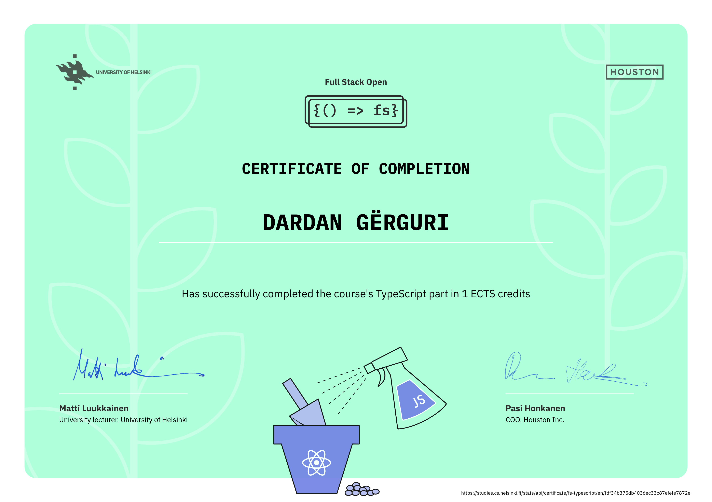

# Full Stack Open

Welcome to my repository for the [Full Stack open](https://fullstackopen.com/en/) course offered by the Department of Computer Science at the University of Helsinki.

### 🚀 Overview
This repository contains the solutions for parts 0 to 9, and parts 10 to 13 are in separate repositories (links are in the sections below).

## 🔧 Technology Stack

The complete solutions demonstrate proficiency across the following technologies:

### Frontend
* **JavaScript & TypeScript**
* **React** (with Hooks, Router, Redux, React Query)
* **E2E Testing** (Cypress / Playwright)

### Backend
* **Node.js & Express**
* **MongoDB** (via Mongoose)
* **PostgreSQL**
* **GraphQL** (via Apollo)
* **Jest/Vitest** (Unit & Integration Testing)

### DevOps & Infrastructure
* **Docker & Docker Compose**
* **CI/CD** (GitHub Actions)

## 📚 Course Content

### [Part 0 - Fundamentals of Web Apps](https://fullstackopen.com/en/part0)

Topics: `HTML/CSS`, `JavaScript libraries`, `HTTP requests`, `JSON`, `DOM manipulation`.

Projects:
- [Sequence Diagrams](https://github.com/dardangerguri/FullStackOpen/tree/main/part0) - Illustrates network communication flow for single-page applications versus traditional web apps.

### [Part 1 - Introduction to React](https://fullstackopen.com/en/part1)

Topics: `React components and JSX`, `Props and state management`, `Event handlers`, `React hooks (useState)`.

Projects:
- [Course Info](https://github.com/dardangerguri/FullStackOpen/tree/main/part1/courseinfo) - Simple application to display course information using React components.
- [Unicafe](https://github.com/dardangerguri/FullStackOpen/tree/main/part1/unicafe) - Feedback collection system demonstrating state management with React hooks.
- [Anecdotes](https://github.com/dardangerguri/FullStackOpen/tree/main/part1/anecdotes) - Platform for voting on and displaying random anecdotes.

### [Part 2 - Communicating with server](https://fullstackopen.com/en/part2)

Topics: `HTTP requests with Axios`, `REST APIs consumption`, `Forms and user input handling`, `Rendering collections`, `Effect hook (useEffect)`.

Projects:
- [Course Info](https://github.com/dardangerguri/FullStackOpen/tree/main/part2/courseinfo) - Refactored version of Part 1 project with improved component structure.
- [Countries App](https://github.com/dardangerguri/FullStackOpen/tree/main/part2/countries) - Search and display country information with data fetched from REST Countries API.
- [PhoneBook Frontend](https://github.com/dardangerguri/FullStackOpen/tree/main/part2/phonebook) - Contact management application with CRUD operations, using JSON Server as a mock backend.

### [Part 3 - Programming a server with NodeJS and Express](https://fullstackopen.com/en/part3)

Topics: `Node.js and Express`, `REST API development`, `MongoDB with Mongoose`, `Middleware error handling`, `ESlint`, `Deployment`.

Projects:
- [PhoneBook Backend](https://github.com/dardangerguri/FullStackOpen-Part3) - Express-based phonebook backend for the Part 2 frontend, using Mongoose and MongoDB for data storage, validation.

### [Part 4 - Testing Express servers, user administration](https://fullstackopen.com/en/part4)

Topics: `Backend testing with Jest/Supertest`, `User authentication (JWT)`, `Password hashing (bcrypt)`, `Async/await`.

Projects:
- [Bloglist Backend](https://github.com/dardangerguri/FullStackOpen/tree/main/part4/bloglist) - Backend built with Express to create, read, and update blog posts, with some endpoints requiring authentication and tests written using Jest and SuperTest.

### [Part 5 - Testing React apps](https://fullstackopen.com/en/part5)

Topics: `React component testing (Jest and React Testing Library)`, `End-to-end testing with Playwright`, `Frontend authentication`, `PropTypes`.

Projects:
- [Bloglist Frontend and Playwright](https://github.com/dardangerguri/FullStackOpen/tree/main/part5) - Full frontend for the Bloglist application with login functionality, blog management, and comprehensive end-to-end testing using Playwright.

### [Part 6 - Advanced state management](https://fullstackopen.com/en/part6)

Topics: `Redux fundamentals`, `Redux Thunks for async actions`.

Projects:
- [Query Anecdotes](https://github.com/dardangerguri/FullStackOpen/tree/main/part6/query-anecdotes) - Anecdotes application using React Query for server state management.
- [Redux Anecdotes](https://github.com/dardangerguri/FullStackOpen/tree/main/part6/redux-anecdotes) - Anecdotes application rebuilt with Redux for global state management.
- [Unicafe Redux](https://github.com/dardangerguri/FullStackOpen/tree/main/part6/unicafe-redux) - Unicafe feedback system reimplemented using Redux.

### [Part 7 - React router, custom hooks, styling app with CSS and webpack](https://fullstackopen.com/en/part7)

Topics: `React Router`, `Custom Hooks`, `Styling (CSS, Material-UI)`, `Webpack configuration`, `Class components`.

Projects:
- [Bloglist](https://github.com/dardangerguri/FullStackOpen/tree/main/part7/bloglist) - Bloglist application with routing, custom hooks, and improved UI.
- [Routed Anecdotes](https://github.com/dardangerguri/FullStackOpen/tree/main/part7/routed-anecdotes) - Anecdotes application with React Router for navigation between views.
- [Country Hook](https://github.com/dardangerguri/FullStackOpen/tree/main/part7/country-hook) - Country search application demonstrating custom hooks for API calls.
- [Ultimate Hooks](https://github.com/dardangerguri/FullStackOpen/tree/main/part7/ultimate-hooks) - Collection of custom React hooks for various use cases.

### [Part 8 - GraphQL](https://fullstackopen.com/en/part8)

Topics: `GraphQL queries and mutation`, `Apollo Client and Server`, `DataLoader`, `Subscriptions`.

Projects:
- [Library App](https://github.com/dardangerguri/FullStackOpen/tree/main/part8/) - Book library application with GraphQL backend and frontend, featuring real-time updates.

### [Part 9 - TypeScript](https://fullstackopen.com/en/part9)

Topics: `TypeScript`, `Form Validation (Formik)`, `Semantic UI React`.

Projects:
- [Course Info](https://github.com/dardangerguri/FullStackOpen/tree/main/part9/courseinfo) - Course information application rewritten in TypeScript.
- [Flight Diary](https://github.com/dardangerguri/FullStackOpen/tree/main/part9/flight-diary) - Flight diary application with TypeScript backend and frontend.
- [Patientor](https://github.com/dardangerguri/FullStackOpen/tree/main/part9/patientor) - Medical records management application with full TypeScript stack.
- [TypeScript Exercises](https://github.com/dardangerguri/FullStackOpen/tree/main/part9/typescript-exercises) - Collection of TypeScript practice exercises.

### [Part 10 - React Native](https://fullstackopen.com/en/part10)

Topics: `React Native development`, `Expo framework`, `Mobile app styling`, `Form handling on mobile`.

Projects:
- [Rate Repository App](https://github.com/dardangerguri/FullStackOpen-Part10) - Mobile application for rating and reviewing GitHub repositories.

### [Part 11 - CI/CD](https://fullstackopen.com/en/part11)

Topics: `GitHub Actions`, `Continuous Integration pipelines`, `Automated testing and deployment`.

Projects:
- [CI/CD pipeline for the Pokedex App](https://github.com/dardangerguri/full-stack-open-pokedex) - Complete CI/CD pipeline for a Pokedex application.
- [CI/CD pipeline for the Phonebook App](https://github.com/dardangerguri/FullStackOpen-Part11) - CI/CD implementation for the Phonebook application.

### [Part 12 - Containers](https://fullstackopen.com/en/part12)

Topics: `Docker containerization`, `Docker Compose`.

Projects:
- [ToDo App](https://github.com/dardangerguri/FullStackOpen-Part12/tree/main/todo-app) - Todo application containerized with Docker.
- [Flight Diary](https://github.com/dardangerguri/FullStackOpen-Part12/tree/main/flight-diary) - Flight diary application deployed using Docker containers.

### [Part 13 - Using relational databases](https://fullstackopen.com/en/part13)

Topics: `Sequelize`, `PostgreSQL`, `Database migrations`.

Projects:
- [Bloglist SQL](https://github.com/dardangerguri/FullStackOpen-Part13) - Bloglist application rebuilt with PostgreSQL and Sequelize ORM.

## 🏅 Course Certificates

#### Full Stack Open: Core (Part 0-7)

#### Full Stack Open: GraphQL (Part 8)

#### Full Stack Open: TypeScript (Part 9)

#### Full Stack Open: React Native (Part 10)

#### Full Stack Open: CI/CD (Part 11)

#### Full Stack Open: Containers (Part 12)

#### Full Stack Open: Relational databases (Part 13)

